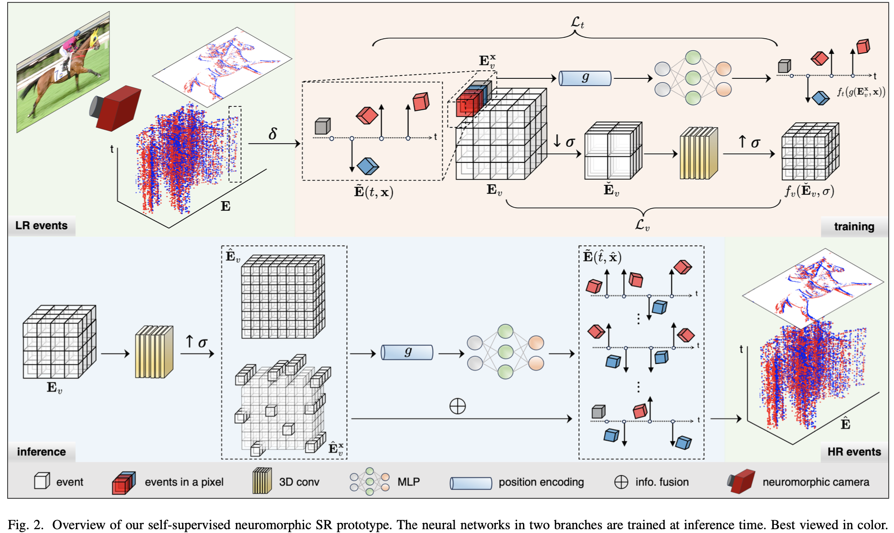
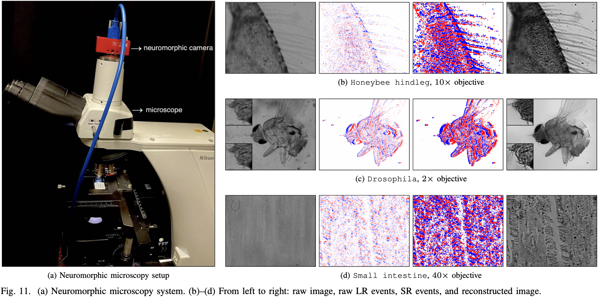

# Overview
This repo provides the code of [Neuromorphic Imaging with Super-Resolution](https://doi.org/10.1109/TCSVT.2024.3482436).
```
@article{zhang2024tcsvt,
  title    =  {Neuromorphic Imaging with Super-Resolution},
  author   =  {Pei Zhang and Shuo Zhu and Chutian Wang and Yaping Zhao and Edmund Y. Lam},
  journal  =  {IEEE Transactions on Circuits and Systems for Video Technology},
  doi      =  {10.1109/TCSVT.2024.3482436},
}
```




## Implementation
NOTE: The code provides an unoptimized prototype allowing you to make modifications as needed. You can try other networks and learning settings to meet various scenarios.
1. Prepare your event sample (with `t, x, y, p` entries) in the `data` folder.
2. Run the program
   ```
   CUDA_VISIBLE_DEVICES=0 python run_task.py
   ```
3. Check the `result` folder for output files.

## Result
3D visualization (x, y, t) is a simple way to verify your result and its distribution.
